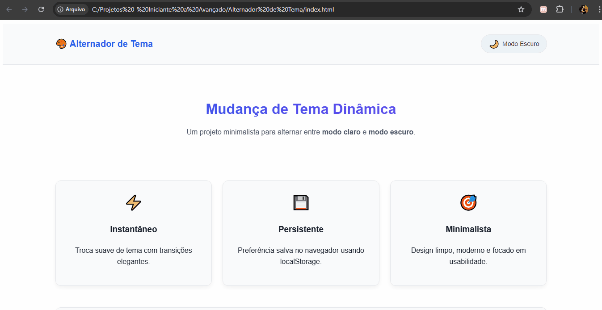

# ☀️🌙 Alternador de Tema
Este projeto é uma aplicação web simples que permite aos usuários alternar entre um tema claro e um tema escuro. O objetivo principal é demonstrar o uso do localStorage para persistir as preferências do usuário, garantindo que o tema selecionado seja mantido mesmo após o recarregamento da página.

---
### 📸 Demonstração


---
### ✨ Funcionalidades

- **Alternância de Tema:** Altera o esquema de cores da página entre os modos claro e escuro.
- **Persistência de Preferência:** Salva a escolha do usuário no `localStorage`, garantindo que o tema seja mantido entre as sessões.
- **Status de Tema:** Exibe o tema atual e a data e hora da última alteração.

---
### 🛠️ Tecnologias Utilizadas

- **HTML:** Para a estrutura da página.
- **CSS:** Para a estilização e os temas claro/escuro.
- **JavaScript:** Para a lógica de alternância, interação com o DOM e manipulação do `localStorage`.

---
### 🚀 Como Usar

Você pode acessar a versão online aqui:
[Demonstração Online](https://devrodrigobrito.github.io/alternador-de-tema/)  
Ou, se preferir rodar localmente em sua máquina:    

1.  Clone este repositório para o seu ambiente de desenvolvimento.
    ```bash
    git clone https://github.com/devrodrigobrito/alternador-de-tema.git
    ```
2. Abra o arquivo `index.html` em seu navegador.
3. Clique no botão de alternância para mudar o tema.

---
### 🧠 Aprendizados

Durante o desenvolvimento deste projeto, explorei e solidifiquei os seguintes conceitos:

- Manipulação do DOM (Document Object Model) com JavaScript.
- Uso do `localStorage` para armazenar dados no navegador.
- Aplicações de boas práticas de programação, como o princípio DRY (Don't Repeat Yourself), com a criação da função `updateUI()`.
- Uso do operador ternário (`? :`) para código mais conciso.
- Organização de código e refatoração.

---
### 📄 Licença

Este projeto está sob a licença MIT. Para mais detalhes, consulte o arquivo `LICENSE` neste repositório.

---
### 👨‍💻 Autor
- **Rodrigo Brito** - Desenvolvedor Front-End em formação
- [GitHub](https://github.com/devrodrigobrito)  


